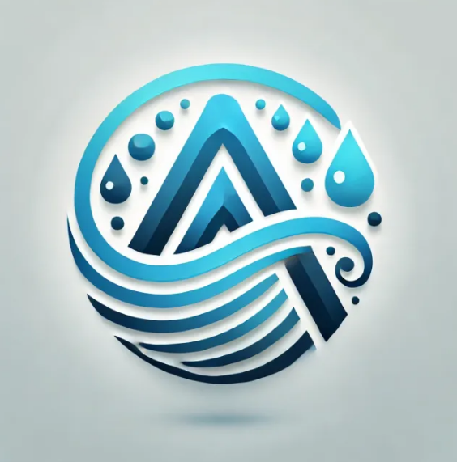

<p align="center">
  
</p>
<h1 align="center">AquaVision</h1>


# 📜 Contexte

Ce projet est une vraie aventure dans le monde des données ! Vous allez créer de A à Z votre propre application d’analyse de données. Le plus cool ? C’est VOUS qui choisissez votre sujet et vos sources de données.

L’idée est simple : vous êtes libre de laisser parler votre créativité sur le QUOI, pendant qu’on vous guide sur le COMMENT. Que vous visiez un projet purment professionnel ou qui joint le personnel, 
c’est l’occasion de développer des compétences concrètes sur un sujet qui vous tient à cœur !

---

# 📘 Objectifs pédagogiques


- Maîtriser les techniques de collecte de données à partir de différentes sources (APIs, fichiers, bases de données).
- Développer des compétences en prétraitement et nettoyage de données avec Python.
- Concevoir et implémenter un pipeline ETL.
- Gérer efficacement une base de données relationnelle.
- Créer des visualisations interactives et des tableaux de bord dynamiques.
- Explorer les possibilités d’enrichissement par l’intelligence artificielle.
- Privilégier une approche modulaire et évolutive
- Documenter régulièrement le code et les choix techniques
- Mettre en place des tests unitaires
- Utiliser le contrôle de version (git)
- Planifier des points d’étape réguliers
- Prévoir une phase de test utilisateur

---

# 📋 Missions et livrable attendus

- Scripts de collecte et d’extraction des données
- Pipeline de nettoyage et prétraitement
- Infrastructure ETL opérationnelle
- Base de données optimisée et documentée
- Tableaux de bord interactifs
- Interface utilisateur fonctionnelle et intuitive
- Documentation technique et guide utilisateur

---

# 🧠 Choix de sujet et approche en équipe

Notre projet a vu le jour grâce à Cynthia, membre de notre équipe, qui travaille dans une entreprise spécialisée dans l’étude des problématiques liées à l'eau. Désireuse de lier son domaine professionnel à notre projet d'analyse de données, 
elle a proposé de travailler sur un sujet en lien avec l'eau. Afin de rendre ce sujet accessible au plus grand nombre, nous avons décidé de nous concentrer sur un aspect concret et quotidien : la qualité de l'eau du réseau public, ainsi que son utilisation et son prix. 
Après plusieurs discussions, nous avons opté pour la création d'une application interactive. Cette application permettra aux utilisateurs de sélectionner une commune sur une carte et d'afficher instantanément les informations pertinentes concernant la qualité de l'eau dans cette région. 
En complément, nous avons envisagé une deuxième phase où nous pourrions collecter des données sur le prix de l'eau et les prélèvements.
Tout cela pourra être complété par un dashboard interactif présentant les données.

# 🛠️ Etapes de projet 

1. Récupération des données qualité de l'eau et géocoding grâce aux différentes APIs:
    - [hubeau](https://hubeau.eaufrance.fr/page/api-qualite-eau-potable)  
    - [adresses](https://adresse.data.gouv.fr/outils/api-doc/adresse)
    - [découpage administratif](https://geo.api.gouv.fr/decoupage-administratif/communes)

2. [Données sur le prix en open data](https://services.eaufrance.fr/pro/telechargement)
3. [Données sur les prélèvements](https://hubeau.eaufrance.fr/page/api-prelevements-eau)

4. Mise en place d'un script streamlit qui permet d'afficher une carte cliquable avec Folium

5. Exploration et nettoyage des données prix de l'eau:
    - [Exploration des données de prix](./docs/recherche/exploration.ipynb)
    - [Création d'une boucle de récupération des prix](./docs/recherche/boucle.ipynb)
    - [Création d'une base de données contenant les prélèvements et les prix](./docs/recherche/exploration2.ipynb)
    - [Exploration et préparation des données sur la qualité](prepa_donnees_qualite.ipynb)
    - [Exploration et préparation des données sur les prélèvements](code_df_api_hubeau.ipynb)
  
6. [Création d'un carte interactive et de fiches descriptives des communes](carte_eau_idf.py)

7. [Création d'un dashboard interactif des données nettoyées](./docs/images/dashboard_aquavision.png)

---

# 🔚 Conclusion
 
L'étude et l'analyse des données sur l'eau en Île-de-France, à travers l'application, mettent en évidence l'importance d'une gestion transparente et efficace des ressources en eau. Grâce à l'utilisation des APIs Hub'Eau et SISPEA, les informations sur la qualité de l'eau, les prélèvements et la tarification sont centralisées et accessibles, permettant ainsi une meilleure compréhension des dynamiques locales.
Le Système d’Information sur l’Eau (SI Eau) joue un rôle clé dans la collecte et la diffusion des données essentielles pour le suivi de la ressource en eau et l’évaluation des services publics. En assurant une vision globale et en facilitant l'accès à ces données, il contribue à une prise de décision plus éclairée et à une sensibilisation accrue du grand public sur les enjeux de la gestion de l’eau.
L’eau potable désigne une eau propre à la consommation humaine, répondant à des critères stricts de qualité définis par les autorités sanitaires. Son suivi rigoureux est indispensable pour garantir la santé publique. Parallèlement, l’assainissement regroupe l’ensemble des processus visant à collecter, traiter et évacuer les eaux usées afin de préserver l’environnement et limiter les risques sanitaires.
L’initiative vise donc à renforcer la transparence, optimiser l'utilisation de l’eau car c’est une ressource limitée et soutenir les politiques publiques en faveur d’une gestion durable de cette ressource vitale. L’intégration de ces données dans des outils interactifs et accessibles, comme le tableau de bord développé, constitue un levier essentiel pour améliorer la gouvernance et la préservation de l’eau en France.


---

## 🏗️ Structure du dépôt
```
AquaVision/
├── .streamlit/                      # Fichier config.toml
├── dashboard/                       # Contient les fichiers utilisés pour réaliser le dashboard
    ├── images/                      # Toutes les images utilisées dans le dashboard
    ├── recherche/                   # Contient les noteboooks d'extraction et de traitement des données du dashboard
    ├── donnees/                     # Contient les données du dashboard assez légères pour y être intégrées
        ├── brutes/                  # Toutes les données telles qu'elles ont été récupérées 
        ├── nettoyees/               # Contient les données une fois qu'elles ont été travaillées
├── donnees_geo/                     # Contient les fichiers geojson utilisés dans le streamlit
├── export/                          # Contient les fichiers csv utilisés dans le streamlit
├── images/                          # Contient les images utilisés dans le streamlit
├── carte_eau_idf.py                 # Fichier streamlit
├── prepa_donnees_qualite.ipynb      # Transformation des données streamlit
├── code_df_api_hubeau.ipynb         # Extraction des données streamlit
├── requirements.txt                 # Fichier requirements pour le streamlit
├── LICENSE
└── README.md 


```


# 🔑 License

[**MIT**](./LICENSE)

